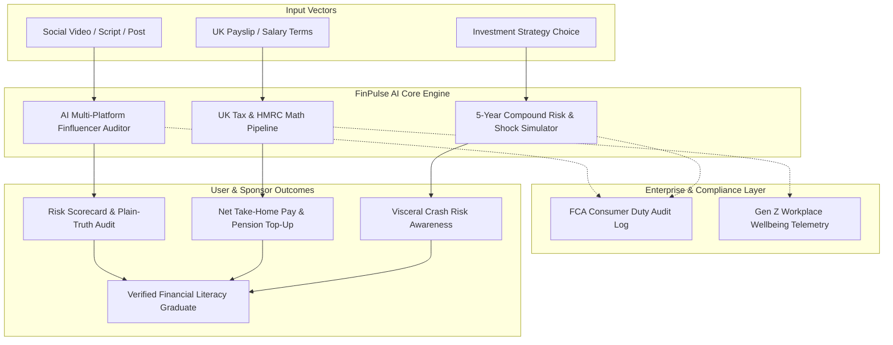
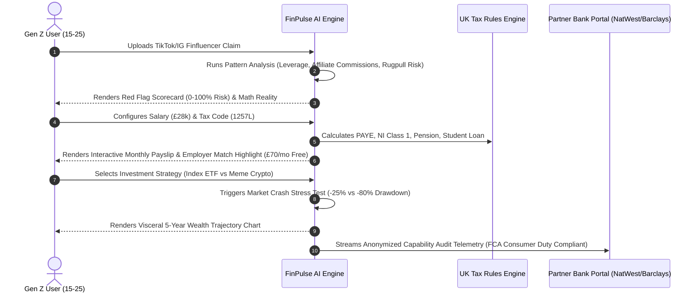
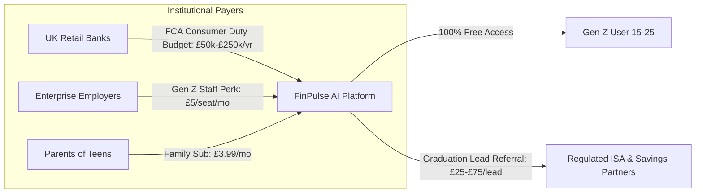

<div align="center">

  # ⚡ FinPulse AI
  ### Next-Generation Financial Immunity & Capability Engine for Gen Z

  [](https://workinfintech.com)
  [](https://www.fca.org.uk/firms/consumer-duty)
  []()
  []()

  <p align="center">
    <strong>Duolingo for Money + AI Anti-Scam Shield</strong><br>
    Built for the <strong>Work in Fintech AI Summit & AI Hackathon 2026</strong> @ NatWest Conference Centre, London.
  </p>

  [Explore Live Prototype](http://localhost:8080) • [View Strategy PDF](FinPulse_AI_Hackathon_Winning_Pack.pdf) • [Architecture Specs](#-system-architecture--workflow) • [FCA Compliance](#-fca-consumer-duty-compliance)

</div>

---

## 🏛️ Executive Summary

**FinPulse AI** is an enterprise-grade financial literacy and AI protection platform engineered for retail banks (e.g. NatWest, Barclays, Monzo) and corporate employers. It bridges the gap between viral social media financial misinformation (*"TikTok Finfluencers"*) and critical life decisions (*UK Payslip PAYE tax codes, pension matches, and long-term asset compounding*).

### The Dual-Engine Core:
* 🛡️ **Consumer Layer (100% Free for Gen Z)**: Real-time multi-platform finfluencer BS scanner, interactive UK salary/payslip tax engine, and visceral 5-year compound growth risk sandbox.
* 🏦 **Enterprise B2B Layer (SaaS)**: Institutional compliance analytics dashboard enabling banks to satisfy UK **FCA Consumer Duty rules (FG22/5)** and measure verified customer financial capability.

---

## 📐 System Architecture & Workflow



### Data Sequence Workflow



---

## ⚡ Enterprise Module Matrix

### 1. Multi-Platform Social Media BS Scanner
* **Input Vectors**: TikTok, Instagram Reels, YouTube Shorts, X (Twitter), and Reddit posts.
* **Audit Sub-Engines**:
  - **Leverage Multiplier Detector**: Identifies 50x–100x margin traps that cause 99% retail drawdowns.
  - **Affiliate Commission Discloser**: Exposes hidden broker kickback links driving finfluencer recommendations.
  - **Smart Contract & Liquidity Drain Classifier**: Detects unverified DEX tokens and honeypots.

### 2. UK HMRC Tax & Payslip Engine
* **Supported Tax Codes**: `1257L` (Standard), `BR` (Basic Rate Emergency 20%), `1257L-M1` (Month 1 Emergency).
* **Calculations**:
  - PAYE Income Tax (20% basic rate threshold calculation).
  - Class 1 Primary National Insurance (8% rate).
  - Workplace Auto-Enrolment Pension (Employee 5% + **Employer 3% Match Callout**).
  - Student Loan Repayment Plans: Plan 1, Plan 2 (£27,295 threshold), Plan 5 (£25,000 threshold), Postgrad.

### 3. "Investors, Not Gamblers" Compound Growth Engine
* **Market Shock Testing**: Simulates historical drawdowns (e.g. 2008 Financial Crash, 2020 Pandemic Panic) to test user emotional resilience *before* real money is invested.

### 4. FCA Consumer Duty Enterprise Dashboard
* **Regulatory Standard**: UK Financial Conduct Authority (FCA) **Consumer Duty Rules (FG22/5)**.
* **B2B Analytics Provided**:
  - Customer Vulnerability & Understanding Telemetry.
  - Scam Prevention Audit Logs (Est. £1.8M saved per 100k account cohort).
  - Verified Capability Certification for first-time ISA applicants.

---

## 💼 Business Model & Monetization Architecture



### Revenue Breakdown:
1. **Bank Enterprise Licensing**: £50,000 – £250,000 / year per bank (NatWest, Barclays, Monzo).
2. **Employer Wellbeing Perk**: £5 per employee / month (£60 / year per active seat).
3. **Family & Parent Subscriptions**: £3.99 / month per family for under-18 safety features.
4. **Partner Lead Generation**: £25 – £75 CPA per verified 18+ ISA account opening.

---

## 📁 Repository Structure

```
finpulse-ai/
├── index.html                     # Main Single Page Application (SPA) shell
├── style.css                      # Design system (Dark mode, Glassmorphism, CSS variables)
├── app.js                         # Core state engine, scanners, calculators & HTML5 Canvas
├── finpulse_pdf_template.html     # High-resolution PDF strategy pack layout
├── make_pdf.js                    # Node.js automated PDF generation script
├── FinPulse_AI_Hackathon_Winning_Pack.pdf # Printable executive briefing pack
├── README.md                      # Enterprise system specification & documentation
└── .gitignore                     # Repository exclusions
```

---

## 🚀 Installation & Local Deployment

### Prerequisites:
- Web Browser (Chrome, Edge, Safari, Firefox)
- Python 3.x OR Node.js (v18+)

### Quick Start:

```bash
# 1. Clone repository
git clone https://github.com/ShieldTech-Ltd/finpulse-ai.git
cd finpulse-ai

# 2. Launch Local Dev Server (Option A: Python)
python -m http.server 8080

# OR (Option B: Node.js)
npx serve -l 8080
```

Access the live application at: `http://localhost:8080`

---

## 🔒 Security, Compliance & Data Privacy

* **GDPR & Privacy First**: Zero Personally Identifiable Information (PII) is stored or transmitted. All salary and financial calculations run client-side in browser memory.
* **FCA Guardrails**: Educational simulation tool only. Does not provide regulated financial advice under Section 19 of the Financial Services and Markets Act 2000 (FSMA).

---

<div align="center">
  <p>Built with ❤️ for the <strong>Work in Fintech AI Summit & AI Hackathon 2026</strong></p>
  <p>© 2026 ShieldTech Ltd & FinPulse AI. All rights reserved.</p>
</div>
